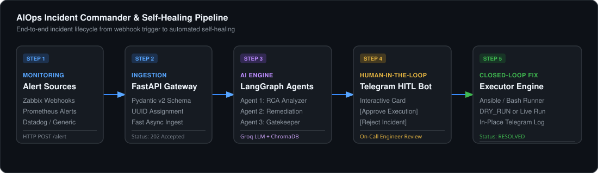
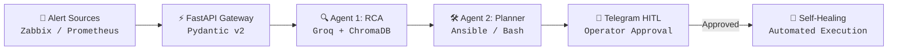
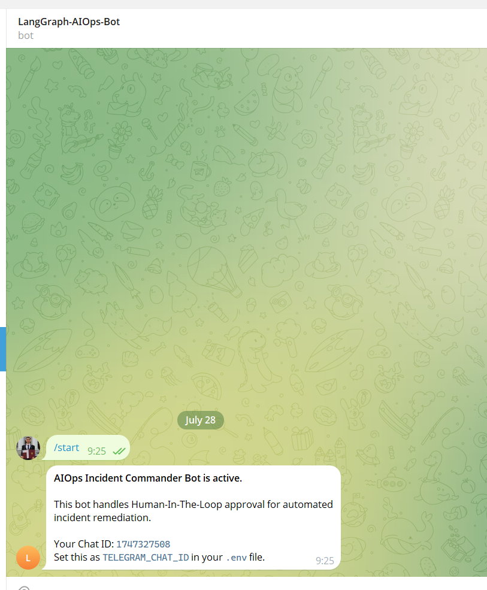
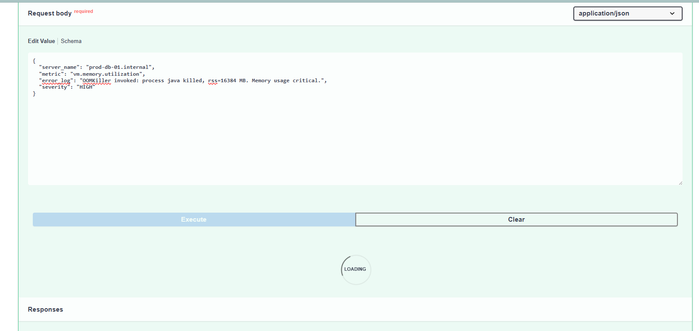
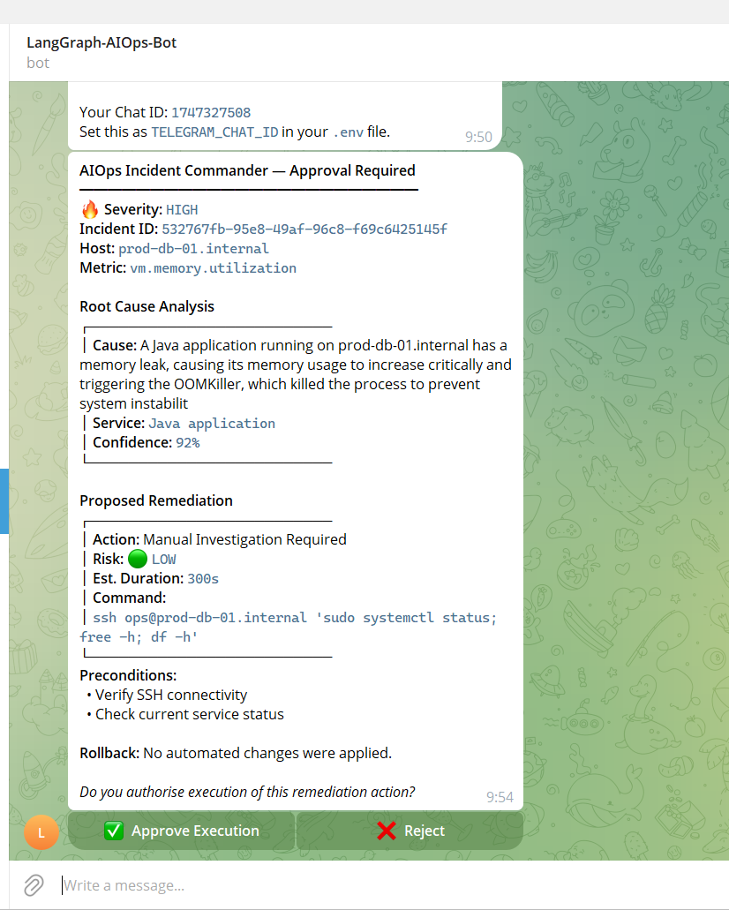
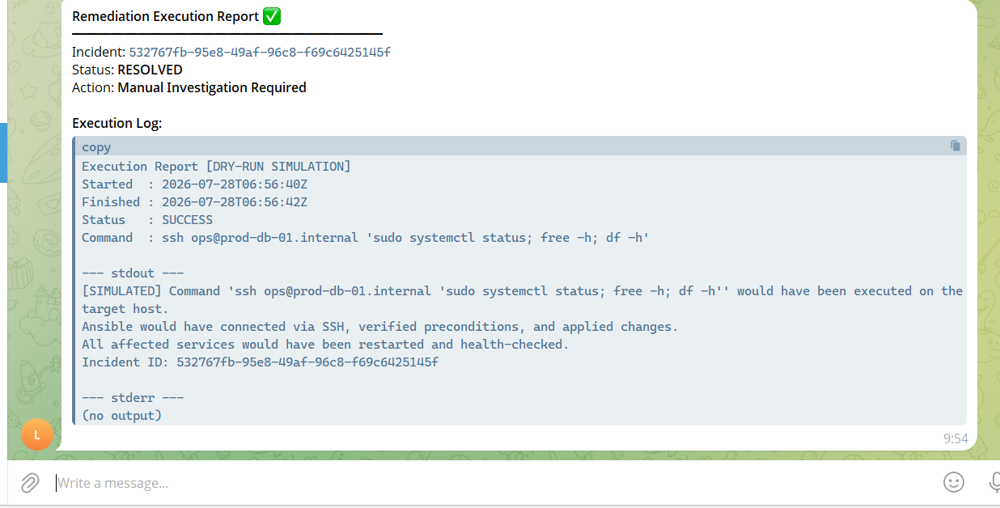
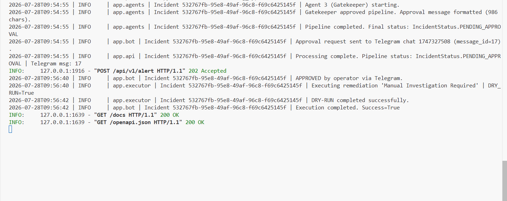

# AIOps Incident Commander & Self-Healing Gateway

---

## Abstract

AIOps Incident Commander is an enterprise-grade, open-source AIOps platform built in Python. It automates the full incident response lifecycle -- from webhook ingestion through root cause analysis, remediation planning, human approval, and automated execution -- by composing a suite of modern AI and infrastructure technologies.

The platform ingests alert webhooks from monitoring systems such as Zabbix and Prometheus AlertManager, passes the alert through a LangGraph-orchestrated multi-agent pipeline powered by Groq LLM inference, retrieves contextual guidance from a ChromaDB vector knowledge base of Standard Operating Procedures, and presents a structured remediation plan to an on-call engineer via a Telegram Bot with interactive inline approval buttons. Upon approval, the platform executes Ansible or Bash remediation commands and reports the outcome in real time.

All inter-component data contracts are enforced by Pydantic v2 schemas with field-level validation, ensuring type safety across the full pipeline.

---

## Architecture Overview






**Supporting components:**

| Component | Technology | Purpose |
|---|---|---|
| API Gateway | FastAPI + Uvicorn | Webhook ingestion & REST API |
| Agent Orchestration | LangGraph StateGraph | Multi-step agent workflow |
| LLM Inference | Groq Cloud (llama-3.3-70b-versatile) | RCA & remediation reasoning |
| Knowledge Base | ChromaDB + sentence-transformers | RAG over SOP runbooks |
| HITL Approval | python-telegram-bot v20+ | Interactive operator workflow |
| Data Validation | Pydantic v2 | Schema enforcement & type safety |
| Remediation | Ansible / Bash via asyncio subprocess | Automated command execution |

---

## Multi-Agent Workflow

### Agent 1: Root Cause Analyzer

- Receives the validated `AlertPayload` from the LangGraph state.
- Issues a semantic query to ChromaDB using the `sentence-transformers/all-MiniLM-L6-v2` embedding model to retrieve relevant SOP passages.
- Constructs a structured prompt embedding the alert details and retrieved runbook context.
- Invokes Groq LLM to produce a `RCAAnalysis` object: root cause explanation, confidence score (0.0--1.0), affected service name, and supporting evidence.

### Agent 2: Remediation Planner

- Receives the `RCAAnalysis` from the state produced by Agent 1.
- Reasons over the root cause, affected service, and alert context to select an appropriate remediation action.
- Produces a `RemediationPlan` object: an Ansible playbook invocation or Bash command, a risk level classification (LOW / MEDIUM / HIGH), rollback instructions, estimated duration, and preconditions.

### Agent 3: Gatekeeper & Validator

- Validates that all required state components (`alert`, `rca`, `remediation`) are present and non-null.
- Formats a structured Markdown-compatible Telegram message combining all pipeline outputs.
- Sets the incident status to `PENDING_APPROVAL` and populates the `approval_message` field.

### Human-In-The-Loop Resolution

- The Telegram Bot dispatches the approval message with two inline keyboard buttons.
- If the operator presses **Approve Execution**, the executor module runs the remediation command (simulated in `DRY_RUN=true` mode) and edits the Telegram message in place with the full execution log.
- If the operator presses **Reject**, the incident is marked as `REJECTED` and no changes are applied to the target infrastructure.

---

## Screenshots

### 1. Telegram Bot Initialization

The operator sends `/start` to the Telegram bot. The bot responds with a confirmation message and returns the Chat ID required for `.env` configuration.



---

### 2. Swagger UI -- Alert Submission

An alert webhook is submitted via the FastAPI Swagger UI at `/docs`. The request body contains the `AlertPayload` JSON with the affected server, metric name, error log, and severity classification. The LangGraph multi-agent pipeline is triggered upon submission.



---

### 3. Telegram HITL -- Approval Request

After the three-agent pipeline completes, the bot sends a structured approval request to the operator. The message displays the Root Cause Analysis (cause, affected service, confidence score) and the Proposed Remediation (action, risk level, command, preconditions, rollback plan). Two inline buttons are presented: **Approve Execution** and **Reject**.



---

### 4. Telegram HITL -- Execution Report

Upon pressing **Approve Execution**, the executor module runs the remediation command in DRY-RUN simulation mode. The Telegram message is edited in-place to display the full Execution Report, including timestamps, command executed, stdout/stderr output, and final status (RESOLVED).



---

### 5. Terminal -- Full Pipeline Logs

The server terminal displays structured, timestamped logs for the entire incident lifecycle: alert ingestion, three-agent pipeline execution, Telegram notification dispatch, operator approval callback, and dry-run remediation completion.



---

## System Prerequisites

| Requirement | Version |
|---|---|
| Python | 3.11 or higher |
| pip | 23.0 or higher |
| Groq Cloud account | API key required |
| Telegram Bot | Created via @BotFather |
| Ansible | Optional (required for live execution) |
| Git | Any recent version |

Network access to the following external endpoints is required:
- `api.groq.com` -- Groq LLM API
- `api.telegram.org` -- Telegram Bot API

---

## Installation & Quickstart

### 1. Clone the repository

```bash
git clone https://github.com/hossameid7/aiops-incident-commander.git
cd aiops-incident-commander
```

### 2. Create and activate a virtual environment

```bash
python -m venv .venv

# Linux / macOS
source .venv/bin/activate

# Windows (PowerShell)
.\.venv\Scripts\Activate.ps1

# Windows (if PowerShell policy blocks .ps1 scripts)
.\.venv\Scripts\python.exe main.py
```

### 3. Install dependencies

```bash
pip install --upgrade pip
pip install -r requirements.txt
```

The first installation will download the `sentence-transformers/all-MiniLM-L6-v2` model (~90 MB) to your local HuggingFace cache.

### 4. Configure environment variables

```bash
cp .env.example .env
```

Edit `.env` and fill in the required values:

```ini
GROQ_API_KEY=your_groq_api_key_here
TELEGRAM_BOT_TOKEN=your_bot_token_here
TELEGRAM_CHAT_ID=your_chat_id_here
```

To obtain your `TELEGRAM_CHAT_ID`:
1. Start the bot by sending `/start` in your Telegram chat with the bot.
2. The bot will reply with your Chat ID.
3. Copy that value into `.env`.

### 5. Run the application

```bash
python main.py
```

The server will start on `http://0.0.0.0:8000`. ChromaDB will ingest all runbook files from `data/runbooks/` on first startup. The Telegram bot polling will begin simultaneously.

You can access the auto-generated API documentation at:
- Swagger UI: `http://localhost:8000/docs`
- ReDoc: `http://localhost:8000/redoc`

---

## API Reference

### POST /api/v1/alert

Ingest an alert webhook from a monitoring system.

**Request body (JSON):**

```json
{
  "server_name": "prod-db-01.internal",
  "metric": "vm.memory.utilization",
  "error_log": "OOMKiller invoked: process 'java' killed, rss=16384 MB",
  "severity": "HIGH",
  "trigger_value": "95.4%",
  "host_groups": ["Production", "Linux servers"]
}
```

**Severity values:** `INFORMATION`, `WARNING`, `AVERAGE`, `HIGH`, `DISASTER`

**Response (202 Accepted):**

```json
{
  "incident_id": "550e8400-e29b-41d4-a716-446655440000",
  "status": "PENDING_APPROVAL",
  "server": "prod-db-01.internal",
  "metric": "vm.memory.utilization",
  "severity": "HIGH",
  "rca_summary": {
    "root_cause": "Java heap exhaustion due to memory leak in request handler pool.",
    "affected_service": "java-api-service",
    "confidence": "87%"
  },
  "remediation_summary": {
    "action": "Restart Memory-Leaking Java Service",
    "risk_level": "LOW"
  },
  "telegram_message_id": 42,
  "message": "Incident analysed successfully. Awaiting Human-In-The-Loop approval via Telegram."
}
```

### GET /health

Returns the operational status of all system components.

**Response (200 OK):**

```json
{
  "status": "healthy",
  "timestamp": "2026-07-28T08:00:00Z",
  "version": "1.0.0",
  "components": {
    "fastapi": "operational",
    "chromadb": "ready",
    "llm_model": "llama-3.3-70b-versatile",
    "dry_run_mode": true,
    "runbook_chunks": 24,
    "telegram_chat_configured": true
  }
}
```

### POST /api/v1/zabbix/alert

Alias endpoint for direct Zabbix webhook configuration. Accepts the same payload as `/api/v1/alert`.

### POST /api/v1/prometheus/alert

Alias endpoint for Prometheus AlertManager webhook receivers. Accepts the same payload as `/api/v1/alert`.

---

## Zabbix Webhook Configuration

In Zabbix, navigate to **Administration > Media types > Create media type** and configure a Webhook type with the following script body (substitute your server URL):

```javascript
var params = JSON.parse(value);
var req = new HttpRequest();
req.addHeader('Content-Type: application/json');
var payload = JSON.stringify({
    server_name: params.host,
    metric: params.trigger_name,
    error_log: params.trigger_description + " | Value: " + params.trigger_value,
    severity: params.severity.toUpperCase(),
    trigger_value: params.trigger_value
});
var response = req.post('http://your-aiops-server:8000/api/v1/zabbix/alert', payload);
return response;
```

---

## Configuration Reference

All configuration is controlled via the `.env` file. No hardcoded values exist in the source code.

| Variable | Default | Description |
|---|---|---|
| `GROQ_API_KEY` | (required) | Groq Cloud API key |
| `GROQ_MODEL` | `llama-3.3-70b-versatile` | Groq model identifier |
| `TELEGRAM_BOT_TOKEN` | (required) | Telegram Bot token from @BotFather |
| `TELEGRAM_CHAT_ID` | (required) | Telegram chat ID for alert delivery |
| `API_HOST` | `0.0.0.0` | Uvicorn bind address |
| `API_PORT` | `8000` | Uvicorn bind port |
| `CHROMA_PERSIST_DIR` | `./chroma_db` | ChromaDB on-disk storage path |
| `CHROMA_COLLECTION_NAME` | `runbooks` | ChromaDB collection name |
| `DRY_RUN` | `true` | Simulate command execution without applying changes |
| `ANSIBLE_PLAYBOOK_DIR` | `./playbooks` | Directory for Ansible playbook files |
| `LOG_LEVEL` | `INFO` | Python logging level (`DEBUG`, `INFO`, `WARNING`, `ERROR`) |

---

## Testing

Install test dependencies (included in `requirements.txt`) and run the suite:

```bash
# Run all tests with verbose output
pytest tests/ -v

# Run with asyncio mode configured
pytest tests/ -v --asyncio-mode=auto

# Run a specific test class
pytest tests/test_pipeline.py::TestAlertPayload -v

# Run with coverage report
pytest tests/ -v --cov=app --cov-report=term-missing
```

**Test categories:**

| Test Class | Scope | Description |
|---|---|---|
| `TestAlertPayload` | Unit | Pydantic v2 validation rules |
| `TestRCAAnalysis` | Unit | Confidence score bounds, schema integrity |
| `TestRemediationPlan` | Unit | Risk level enum validation |
| `TestRAG` | Unit/Integration | ChromaDB query function with mocked collection |
| `TestExecutor` | Async Unit | Dry-run execution, log format verification |
| `TestAPIEndpoints` | Integration | FastAPI endpoints via httpx AsyncClient |
| `TestPipelineSmoke` | Integration | End-to-end 3-agent pipeline with mocked LLM |

---

## Adding Custom Runbooks

To extend the knowledge base with new Standard Operating Procedures:

1. Create a `.txt` file in `data/runbooks/`, for example `data/runbooks/cpu_spike.txt`.
2. Delete the existing ChromaDB persistence directory to force re-ingestion:
   ```bash
   rm -rf chroma_db/
   ```
3. Restart the application. ChromaDB will ingest all `.txt` files on startup.

There is no limit to the number of runbook files. The chunking algorithm splits files into 500-character overlapping segments for optimal retrieval granularity.

---

## Security Considerations

- The `.env` file contains sensitive credentials. It is excluded from version control via `.gitignore`. Never commit this file.
- `DRY_RUN=true` is the default. Set it to `false` only in controlled, non-production lab environments after fully understanding the implications.
- The `POST /api/v1/alert` endpoint is unauthenticated by default. In production deployments, place it behind an API gateway with IP allowlisting or shared-secret header validation.
- Ansible inventory files and vault credentials must be stored and managed separately from this repository.
- Telegram inline button callback data contains only the incident UUID. No sensitive information is transmitted through the Telegram API.

---

## Project Structure

```
aiops-incident-commander/
├── .env                        # Runtime credentials (not committed to Git)
├── .env.example                # Template for credential configuration
├── .gitignore                  # Git exclusion rules
├── README.md                   # This document
├── requirements.txt            # Python package dependencies
├── main.py                     # Application entrypoint
├── config.py                   # Pydantic-settings configuration module
├── data/
│   └── runbooks/
│       ├── memory_leak.txt     # SOP: High Memory Usage / Memory Leak
│       └── disk_full.txt       # SOP: Partition Disk Full
├── app/
│   ├── __init__.py
│   ├── models.py               # Pydantic v2 schema definitions
│   ├── rag.py                  # ChromaDB vector store & retrieval
│   ├── agents.py               # LangGraph 3-agent pipeline
│   ├── bot.py                  # Telegram HITL Bot
│   ├── executor.py             # Remediation execution layer
│   └── api.py                  # FastAPI webhook endpoints
├── tests/
│   └── test_pipeline.py        # Unit and integration test suite
└── Screenshots/
    ├── architecture_overview.svg
    ├── 01_telegram_bot_start.png
    ├── 02_swagger_alert_request.png
    ├── 03_telegram_approval_message.png
    ├── 04_telegram_execution_report.png
    └── 05_terminal_pipeline_logs.png
```

---

## Author Information

Hossam Eid | [github.com/hossameid7](https://github.com/hossameid7) | Telegram: [@hossameid7](https://t.me/hossameid7)

---

## License

This project is released as open-source software. Refer to the LICENSE file in the repository root for the terms of distribution and use.
